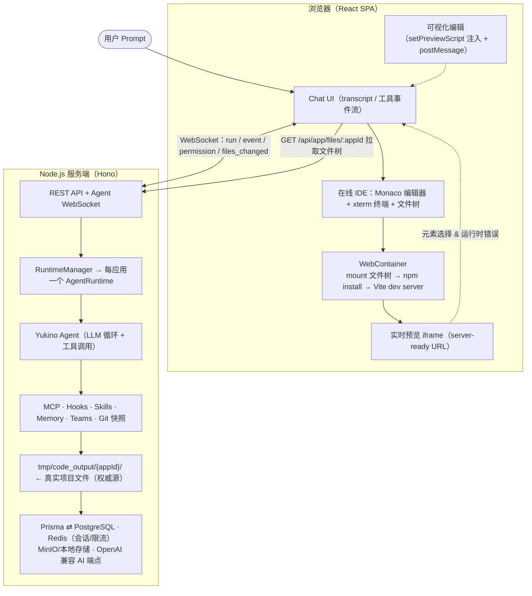
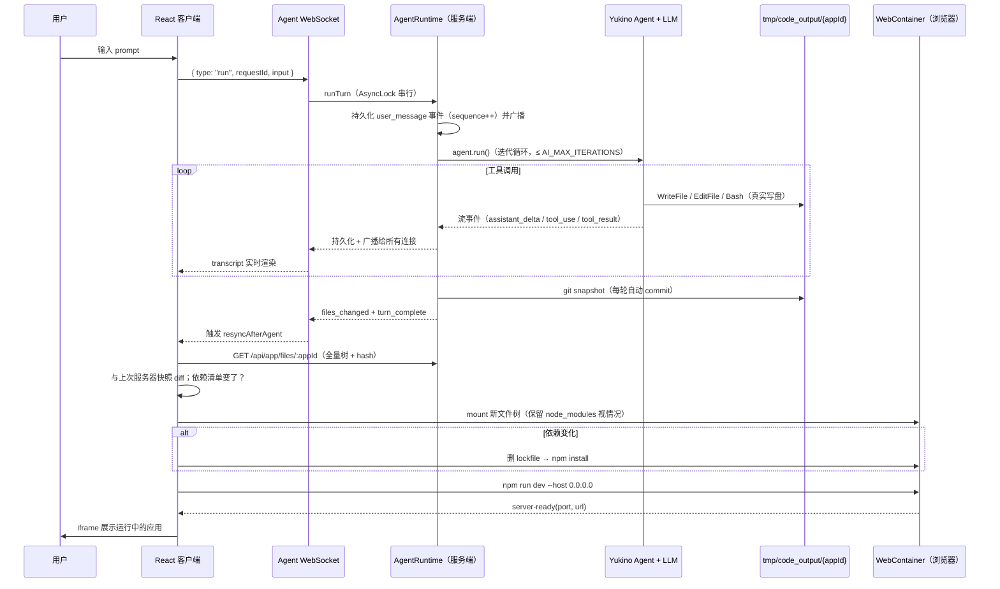

> 基于对仓库源码的全面走读整理（client / server / prisma / prompts / 配置与测试）。
> 重点章节：第 6 章 WebContainer 深度解析。
> 本机器路径: `$HOME/github/yukino-codegen`

---

## 目录

1. [项目概述](#1-项目概述)
2. [系统总体架构](#2-系统总体架构)
3. [技术栈全景](#3-技术栈全景)
4. [技术背景](#4-技术背景)
5. [技术基础知识](#5-技术基础知识)
6. [WebContainer 深度解析（重点）](#6-webcontainer-深度解析重点)
7. [核心数据流与关键机制](#7-核心数据流与关键机制)
8. [服务端 Agent 运行时（Yukino 集成）](#8-服务端-agent-运行时yukino-集成)
9. [安全设计](#9-安全设计)
10. [可观测性与运维](#10-可观测性与运维)
11. [工程化与质量保障](#11-工程化与质量保障)
12. [附录](#12-附录)

---

## 1. 项目概述

**Yukino Codegen** 是一个 AI 代码生成平台（"AI 建站 / AI 生成 Web 应用"类产品，对标 bolt.new、v0.dev、Lovable）。核心产品承诺是：

> **"Describe it. Watch it build itself — right in your browser."**
> 一句自然语言 prompt → 一个真实可运行的 Web 应用。

它与传统"模板填充"式 AI 建站的本质区别在于两点：

1. **服务端跑的是一个完整的编码 Agent**（`@yukino.js/yukino`，与 Yukino 终端编码代理同一引擎），拥有真实文件工具（`ReadFile` / `WriteFile` / `EditFile` / `Glob` / `Grep` / `Bash`），把生成的 Vite + TypeScript 项目**真实写入服务器磁盘**（`tmp/code_output/{appId}/`），并支持 MCP、Hooks、Skills、Memory、Subagent、Teams 等完整 Agent 能力。
2. **浏览器端用 WebContainer 做即时预览**：生成的文件树同步进浏览器内的 WebContainer（基于 WebAssembly 的 Node.js 运行时），在**用户浏览器标签页内**完成 `npm install` 和 Vite dev server 启动——服务器零构建成本，用户在 Agent 完成后几秒内看到应用运行。

围绕这条主链路，项目还提供了完整的产品面：

- 认证（注册/登录/登出）、应用广场（awesome list）、我的应用、聊天记录持久化与回放；
- 每应用一个 Agent 工作区：会话 transcript、权限模式、MCP 服务器（密钥 AES-256-GCM 加密存储）、生命周期 Hooks、Skills、长期记忆、子代理与团队；
- **可视化编辑**：在实时预览 iframe 中点选元素 → 描述修改 → Agent 映射回源码；预览的编译/运行时错误可一键回传给 Agent 修复；
- **Git 快照安全网**：每轮对话后自动对生成项目做 git commit，可列出快照并回滚（rewind）；
- Monaco 代码编辑器 + xterm.js 终端 + 文件树浏览器组成的完整在线 IDE 工作区；
- 管理后台（用户 / 应用 / 聊天三个控制台）、zip 下载导出；
- 生产级后端基建：Zod 环境变量校验（拒绝不安全生产默认值）、Redis 会话与限流、MinIO 对象存储、Prometheus 指标与健康探针。

---

## 2. 系统总体架构

### 2.1 架构总览



### 2.2 职责划分的关键设计决策

| 决策                                            | 内容                                                                         | 理由                                                                                       |
| ----------------------------------------------- | ---------------------------------------------------------------------------- | ------------------------------------------------------------------------------------------ |
| **服务器磁盘是文件的权威源（source of truth）** | Agent 写文件到 `tmp/code_output/{appId}/`，浏览器只是"投影"                  | Agent 工具（Bash、EditFile）需要真实文件系统；zip 导出、git 快照、多端共享都基于服务器文件 |
| **构建/运行完全在浏览器（WebContainer）**       | `npm install`、Vite dev server 都在用户标签页内跑                            | 服务器零构建成本、零沙箱逃逸风险（浏览器天然沙箱）、预览秒级启动                           |
| **WebSocket 承载 Agent 协议，REST 承载 CRUD**   | transcript 事件、权限交互、files_changed 走 WS；用户/应用/文件树走 REST      | 流式双向交互 vs 幂等请求的合理分工                                                         |
| **每应用一个长驻 AgentRuntime**                 | `RuntimeManager` 以 `${ownerId}:${appId}` 为键缓存运行时，空闲 15 分钟后回收 | Agent 会话跨连接存活；多浏览器标签共享同一运行时                                           |

### 2.3 目录结构

```text
.
├── client/                          React 19 SPA（Vite 7）
│   └── src/
│       ├── app/                     路由、Providers、页面过渡动画
│       ├── pages/
│       │   ├── home/                首页 + prompt 输入
│       │   ├── app-chat/            核心页：聊天 + 预览 + IDE 工作区
│       │   │   ├── workspace/       WebContainer 运行时、FS、终端、编辑器
│       │   │   └── chat/            transcript 视图、权限对话框、能力抽屉
│       │   ├── app-edit/            应用信息编辑
│       │   ├── user-login|register/ 认证页
│       │   └── admin-*/             用户/应用/聊天三个管理控制台
│       └── shared/
│           ├── api/                 axios 封装、各资源 API、错误处理
│           ├── auth/                Zustand 用户 store、路由守卫
│           ├── schemas/             Zod schema（与后端协议对齐）
│           ├── query/               TanStack Query hooks 与 query keys
│           ├── ui/                  Base UI + Tailwind 组件库（40+ 组件）
│           └── webcontainer/        WebContainer boot 单例 + 文件树 schema
├── server/                          Hono 4 后端（Node.js ≥ 20）
│   ├── prisma/                      schema.prisma + migrations（8 张表）
│   ├── prompts/                     site-generator-system-prompt.md
│   └── src/
│       ├── agent-runtime/           Yukino Agent 集成层（22 个模块）
│       ├── routes/                  user · app · agent(ws/rest/files) · chat-history · management
│       ├── session/                 会话存储（Redis / 内存）与认证中间件
│       ├── deployment/              存储适配器（local / MinIO）
│       ├── observability/           健康检查、Prometheus 指标、请求上下文
│       ├── config/                  Zod env & AI schema（fail-fast）
│       ├── middleware/              CORS、body limit、错误处理、安全头
│       ├── rate-limit/              Redis 计数窗口限流
│       ├── database/                Prisma 客户端装配（src/generated/prisma）
│       ├── project/                 输出目录构建（tmp/code_output/{appId}）与 zip 下载
│       ├── user/ · app-module/      用户、应用两个领域的 service/repository/schema
│       ├── chat-history/            聊天历史查询
│       └── common/                  crypto、错误码、HTTP 错误、分页等公共件
└── docs/                            图片
```

---

## 3. 技术栈全景

### 3.1 客户端

| 技术                                                 | 版本                       | 在本项目中的角色                                                                            |
| ---------------------------------------------------- | -------------------------- | ------------------------------------------------------------------------------------------- |
| **React**                                            | 19.3                       | UI 框架；使用函数组件 + Hooks                                                               |
| **Vite**                                             | 7.3                        | 开发服务器（含 COOP/COEP 头注入、`/api` 代理）与生产构建                                    |
| **TypeScript**                                       | 5.8（strict）              | 全量类型安全                                                                                |
| **Tailwind CSS**                                     | 4.3（`@tailwindcss/vite`） | 原子化样式；配 `@catppuccin/tailwindcss` 主题、`tailwind-merge`、`class-variance-authority` |
| **@webcontainer/api**                                | 1.6.4                      | 浏览器内 Node.js 运行时（预览核心，见第 6 章）                                              |
| **TanStack Query**                                   | 5.104                      | 服务端状态管理（缓存、失效、乐观更新）                                                      |
| **TanStack Form**                                    | 1.33                       | 类型安全表单（登录/注册/应用编辑）                                                          |
| **TanStack Virtual**                                 | 3.14                       | 长列表虚拟化（transcript、管理表格）                                                        |
| **Zustand**                                          | 5.0                        | 客户端状态（用户 store、auth 水合门）                                                       |
| **react-router**                                     | 7.18                       | SPA 路由（含 `require-auth` / `require-admin` 守卫）                                        |
| **Monaco Editor**                                    | 0.56                       | 在线代码编辑器（VS Code 同款内核），配 Catppuccin 主题与 worker 配置                        |
| **@xterm/xterm**                                     | 6.0（+ addon-fit）         | 浏览器终端，桥接 WebContainer 的 `jsh` shell                                                |
| **@base-ui/react**                                   | 1.8                        | 无样式可访问组件原语（Dialog、Select、Tooltip 等 UI 库底座）                                |
| **Zod**                                              | 4.6                        | 运行时校验：API 响应、WS 协议消息、postMessage、路由参数                                    |
| **axios**                                            | 1.20                       | HTTP 客户端（单例封装 + 401 统一处理）                                                      |
| **socket.io-client / @microsoft/fetch-event-source** | —                          | 遗留流式依赖（src 未再引入；当前主链路为原生 WebSocket）                                    |
| **GSAP / animate.css / react-transition-group**      | —                          | 页面过渡与动画                                                                              |
| **marked + dompurify**                               | —                          | Markdown 渲染 + XSS 消毒（Agent 回复）                                                      |
| **@yukino.js/sentry**                                | latest                     | 前端监控 SDK（Vite dev mock 插件 `sentryPlugin7`，dsn 指向 `/sentry`）                      |
| **lucide-react / sonner / react-resizable-panels**   | —                          | 图标 / Toast / 可拖拽分栏                                                                   |

### 3.2 服务端

| 技术                                  | 版本                         | 角色                                                                                                                                              |
| ------------------------------------- | ---------------------------- | ------------------------------------------------------------------------------------------------------------------------------------------------- |
| **Hono**                              | 4.13                         | 轻量 Web 框架（路由、中间件、`zValidator` 校验）                                                                                                  |
| **@hono/node-server + @hono/node-ws** | 1.19 / 1.3                   | Node 适配器与 WebSocket 升级（`upgradeWebSocket`）                                                                                                |
| **@yukino.js/yukino**                 | latest                       | 编码 Agent 引擎：`Agent`、`Remote.Server.createRemoteAgent`、`Permissions`、`MCP`、`Skills`、`Memory`、`Teams`、`Subagent`、`Worktree`、`Compact` |
| **Prisma**                            | 7.10（`@prisma/adapter-pg`） | ORM；生成客户端到 `src/generated/prisma`；驱动适配器直连 pg                                                                                       |
| **PostgreSQL**（pg 8.23）             | —                            | 主数据库：用户、应用、Agent 工作区/会话/transcript/交互/MCP/Hook                                                                                  |
| **ioredis**                           | 5.11                         | 会话存储（生产必需）+ 限流计数                                                                                                                    |
| **minio**                             | 8.0                          | S3 兼容对象存储（应用封面等；生产必需）                                                                                                           |
| **Zod**                               | 4.6                          | 环境变量 fail-fast 校验、所有请求体/参数校验、WS 协议 schema                                                                                      |
| **archiver**                          | 7.0                          | 项目 zip 流式导出                                                                                                                                 |
| **ws**                                | 8.22                         | WebSocket 底层                                                                                                                                    |
| **tsx / rollup**                      | —                            | 开发热重载 / 生产打包                                                                                                                             |
| **Biome**                             | 2.5                          | 服务端 lint + format（CI 用 `--reporter=github`）                                                                                                 |

### 3.3 基础设施与质量

- **pnpm workspace** monorepo（client + server 两个包），根脚本用 `concurrently` 并发扇出（`pnpm dev` / `build` / `test` / `lint` / `format`）。
- **Vitest** 双端测试：服务端 8 个测试文件（协议、并发、MCP 加密、项目文件路径安全、事件适配器等），客户端按 pages/shared 组织。
- **ESLint 9 + typescript-eslint + unicorn**（客户端，`--max-warnings 0`）；**Prettier**（客户端格式化，含 tailwindcss 插件）。
- **AI 端点**：OpenAI 兼容协议（`AI_PROTOCOL=openai-compat`，默认指向本地 Ollama `http://localhost:11434/v1`），也支持 `anthropic` / `openai` 协议。

---

## 4. 技术背景

### 4.1 产品赛道：从"模板生成"到"Agentic 生成"

AI 生成 Web 应用的产品经历了三代：

1. **模板/低代码拼接**：LLM 输出 JSON 配置，前端用固定组件渲染。上限低，无法表达任意需求。
2. **代码片段生成**：LLM 直接吐代码，人工复制。无运行时验证，错误率高。
3. **Agentic 生成（本项目所在代际）**：LLM 作为 Agent 在真实文件系统上循环"计划 → 调用工具（读/写/编辑/执行）→ 观察结果 → 继续"，产出真实工程化项目；配合浏览器内运行时实现秒级预览与错误反馈闭环。bolt.new（StackBlitz）、v0（Vercel）、Lovable 均属此类。

### 4.2 为什么预览必须放进浏览器？

服务端预览方案（为每个用户起 Docker 容器跑 dev server）的痛点：

- **成本**：每活跃用户一个容器，CPU/内存开销随用户线性增长；
- **冷启动**：容器调度 + 依赖安装动辄数十秒；
- **安全**：在服务器上执行任意生成代码需要重型沙箱（gVisor/Firecracker），运维复杂；
- **隔离**：多租户共享构建缓存带来的泄漏风险。

WebContainer 把这一切翻转为：**计算发生在用户自己的设备上**，浏览器标签页就是沙箱。服务器只负责存储文件和跑 LLM Agent，预览零边际成本。这是 StackBlitz 提出、被 bolt.new 验证过的架构范式，本项目完整落地了该范式并叠加了自研 Agent 引擎。

### 4.3 为什么服务端 Agent 与浏览器预览要"文件双向同步"？

Agent 的工具（`Bash`、`EditFile`）需要真实 POSIX 文件系统，所以生成物必须落盘在服务器；而预览必须在浏览器的 WebContainer 里跑。于是产生了本项目的核心工程难题——**两个文件系统之间的一致性**：

- 服务器 → 浏览器：Agent 每轮改动后推送 `files_changed`，客户端拉取全量树做增量 diff 同步；
- 浏览器 → 服务器：用户在 Monaco 编辑器或 WebContainer 终端里的改动，通过 `fs.watch` + 防抖回写到服务器；
- 冲突：双方同时改同一文件时，用 **sha256 乐观锁 + 三方合并（three-way merge）** 解决（详见 7.3）。

### 4.4 Yukino Agent 引擎背景

`@yukino.js/yukino` 是作者自研的终端 AI 编码代理（同类：Claude Code、Aider、OpenHands），以库形式导出完整 Agent 栈。本项目通过 `Remote.Server.createRemoteAgent` 把"终端里的 Agent"改造成"服务器上的多租户 Agent 服务"，这是整个后端 `agent-runtime/` 目录（22 个模块、约 3600 行）存在的意义：会话持久化、transcript 序列化、权限交互经 WebSocket 转发给浏览器、MCP/Hooks/Skills/Memory 的数据库化管理。

---

## 5. 技术基础知识

本章解释项目中用到的关键技术概念，供不熟悉相应领域的读者建立背景。

### 5.1 LLM Agent 与工具调用（Tool Use / Function Calling）

Agent = LLM + 工具 + 循环。模型每轮输出"文本 + 工具调用请求"，宿主执行工具（如写文件）并把结果作为新消息喂回模型，直到模型认为任务完成。关键概念：

- **工具集**：本项目 Agent 拥有 `ReadFile` / `WriteFile` / `EditFile` / `Glob` / `Grep` / `Bash` / `AskUser` 等；
- **最大迭代数**：`AI_MAX_ITERATIONS`（默认 40）防止无限循环；
- **上下文窗口与压缩（Compact）**：对话过长时自动摘要压缩历史；
- **权限模式**：`DEFAULT`（逐个询问）/ `ACCEPT_EDITS`（自动接受文件编辑）/ `PLAN`（只规划不执行）/ `DONT_ASK` / `BYPASS_PERMISSIONS`（全自动）共 5 种，本项目工作区默认 `BYPASS_PERMISSIONS`；
- **系统提示词**：`server/prompts/site-generator-system-prompt.md` 定义了 Agent 的行为契约——用 `pnpm create vite` 脚手架、**禁止在服务器 install/build/dev**（浏览器负责）、依赖直接改 `package.json`、可见回复只写简短进度叙述等。

### 5.2 MCP（Model Context Protocol）

Anthropic 提出的开放协议，让 Agent 以统一方式接入外部工具/数据源。本项目支持三种传输：`STDIO`（子进程）、`HTTP`、`SSE`，MCP 服务器配置按工作区存库，请求头/环境变量等密钥用 **AES-256-GCM** 加密（`iv || authTag || ciphertext` 打包后 base64 存储），密钥来自 `MCP_SECRET_KEY`（base64 的 32 字节）。

### 5.3 Hono 与中间件模型

Hono 是超轻量 Web 框架（类似 Express/Koa 但 Web Standards 优先、跨运行时）。本项目用法：

- `new Hono<AppHonoEnv>()` 带类型化上下文（`c.get("user")` 有类型）；
- 中间件链：CORS → body limit → 请求上下文（日志）→ session；
- `zValidator("json", schema)`：请求体先过 Zod 校验再进 handler；
- 子路由 `api.route("/user", ...)` 组合，最终挂载到 `/${BASE_URL}`（默认 `/api`）；
- `@hono/node-ws` 的 `upgradeWebSocket` 在同一个 HTTP 服务器上完成 WS 升级。

### 5.4 Zod：运行时类型校验

TypeScript 类型在运行时不存在，所有外部输入（env、HTTP body、WS 消息、postMessage、API 响应）都需要运行时校验。Zod schema 一处定义，`z.infer` 导出静态类型，实现"校验即类型"。本项目双端共享同一套协议 schema 的形状（服务端 `protocol.ts` ↔ 客户端 `shared/schemas/agent-protocol.ts`）。

### 5.5 Prisma 7 + PostgreSQL

Prisma 是类型安全 ORM：`schema.prisma` 声明模型 → 代码生成客户端 → 迁移管理（`prisma migrate`）。Prisma 7 的新特性是**客户端生成到项目内**（`src/generated/prisma`）且通过**驱动适配器**（`@prisma/adapter-pg`）直连 `pg` 驱动。数据模型共 8 张表（见 12.2）。

### 5.6 WebSocket 协议设计基础

长连接双向通信需要自己解决：消息格式、请求关联、断线重连、消息补发。本项目协议（`protocol.ts`，全部 Zod 校验）：

- **客户端 → 服务端**：`hello`（携带 `afterSequence` 请求补发）、`run`、`abort`、`permission_response`、`question_response`、`command_complete`、`runtime_action`、`heartbeat`；
- **服务端 → 客户端**：`ready`（会话状态快照 + 待处理交互）、`event`（单条 transcript 事件）、`transcript_batch`（历史回放，每批 ≤1000 条）、结构化流事件（`assistant_delta` / `tool_use` / `tool_result` / `usage` / `turn_complete` 等）、`permission_request` / `question_request` / `interaction_resolved`、`command_result` / `candidates`（斜杠命令结果与补全候选）、`runtime_status`、`files_changed`、`error`、`heartbeat_ack`；
- **单调序列号**：每条 transcript 事件带数据库分配的 `sequence`（BigInt），客户端记录 high-watermark，重连时 `hello { afterSequence }` 精确补发缺口——这是"至少一次 + 幂等回放"的经典事件溯源设计；
- **心跳**：客户端每 20s 发 `heartbeat`，10s 无 ack 判定断线，指数退避重连（500ms → 15s）。

### 5.7 会话、认证与限流

- Cookie-session：`SESSION_SECRET` 签名，TTL 7 天；存储层抽象为 `SessionStore` 接口，Redis（生产）/ 内存（开发）两个实现；
- 密码：加盐（`PASSWORD_SALT`）哈希存储；
- 限流：Redis 计数窗口，`LLM_RATE_LIMIT=10 次 / 60 秒` 保护昂贵的 Agent 轮次；
- RBAC：`USER` / `ADMIN` 两角色；应用资源区分 owner（可写）与其他登录用户（只读观察）。

### 5.8 乐观锁与三方合并

并发修改同一文件的经典解法：

- **乐观锁**：每个文件带 sha256 `hash`；写请求携带 `expectedHash`，服务器比对当前 hash，不一致返回 `conflict`（而非盲目覆盖）；
- **三方合并**：`base`（共同祖先）/ `local`（本地编辑）/ `server`（服务器新版本）三个文本，若只有一方偏离 base 则取该方，双方都改则报冲突交给 Monaco diff 编辑器人工解决（`workspace-tree.ts` 的 `threeWayMerge`）。

### 5.9 COOP / COEP 与跨源隔离（Cross-Origin Isolation）

浏览器安全模型中，`SharedArrayBuffer`（多线程 WASM 必需）只在**跨源隔离**的页面可用。开启方式是两个响应头：

- `Cross-Origin-Opener-Policy: same-origin`（COOP）：切断与跨源窗口的 opener 关系；
- `Cross-Origin-Embedder-Policy: credentialless`（COEP）：所有跨源子资源要么同源、要么以无凭据方式加载。

`crossOriginIsolated === true` 是 WebContainer 的硬性前提（见第 6 章）。本项目在 Vite dev/preview server 上注入这两个头；README 明确要求自托管构建产物时也必须由服务 HTML 的那一层加上。

### 5.10 其他基础件

- **Monaco Editor**：VS Code 的编辑器内核，浏览器内提供语法高亮、智能提示、diff 视图；需要单独配置 web worker（`monaco-workers.ts`）；
- **xterm.js**：浏览器终端模拟器，本项目把它接到 WebContainer 的 `jsh` shell 上，形成"浏览器里的完整 shell"；
- **TanStack Query**：服务端状态缓存层——query key 分层（`query-keys.ts`）、mutation 后精确失效，避免手写 loading/error 状态机；
- **Prometheus 指标**：`/api/management/prometheus` 暴露文本格式指标，配合 `/management/health`、`/management/info` 供监控系统抓取；
- **SSE（Server-Sent Events）**：单向流式推送协议。客户端 `endpoints.ts` 仍保留 `app/chat/codegen` 的流式端点常量，但当前服务端已无对应路由——实时链路已完全演进为 WebSocket（SSE 是早期方案的遗留）。

---

## 6. WebContainer 深度解析（重点）

### 6.1 WebContainer 是什么

**WebContainer** 是 [StackBlitz](https://stackblitz.com) 开发的技术：**一个完全运行在浏览器标签页内的 Node.js 运行时**。它不是虚拟机、不是远程容器，而是用 WebAssembly 重写的 Node.js 核心 + 模拟文件系统 + 模拟网络栈的组合：

- **WASM 编译的 Node 核心**：事件循环、JS 运行时桥接编译为 WebAssembly；
- **内存文件系统**：`fs` API 由浏览器内存中的虚拟 FS 支撑，页面刷新即重置，可用 `export` API 导出快照；
- **Service Worker 虚拟网络**：容器内进程监听的端口被映射为 `https://xxx.local-credentialless.webcontainer-api.io` 形式（credentialless 模式）的真实可访问 URL——由 Service Worker 拦截对该 URL 的请求并转发给容器内的 dev server，因此可以放进 iframe 预览；
- **原生 npm/Vite 兼容**：容器内置 Turbo npm 客户端（npm CLI 兼容，官方文档称之为 "our npm client"），跑的是真实 Vite，生态兼容性极高；
- **musl 平台**：容器环境模拟 Alpine Linux（musl libc），这带来一个重要的工程细节（见 6.5.4）。

**与传统方案对比**：

| 方案                                      | 执行位置 | 启动时间                       | 服务器成本         | 安全模型                                         |
| ----------------------------------------- | -------- | ------------------------------ | ------------------ | ------------------------------------------------ |
| Docker/VM 预览                            | 服务器   | 秒~分钟                        | 高（每用户一容器） | 需重型沙箱                                       |
| iframe + Babel 转译（如早期 CodeSandbox） | 浏览器   | 即时                           | 零                 | 浏览器沙箱，但只能跑受限 JS，无真实 node_modules |
| **WebContainer**                          | 浏览器   | 亚秒级 boot + 真实 npm install | **零**             | 浏览器沙箱 + WASM 隔离                           |

**硬性约束**：

1. 每个页面（origin + tab）**只能 boot 一个 WebContainer 实例**；
2. 必须 `crossOriginIsolated === true`（COOP + COEP 头，见 5.9）；
3. 仅支持现代浏览器（Chrome/Edge/Firefox/Safari 16.4+ 等支持 WASM 与 SharedArrayBuffer 的版本）。

### 6.2 本项目的 WebContainer 集成总览

客户端与 WebContainer 相关的代码分布在两层：

```text
client/src/shared/webcontainer/          ← 全局基础设施
├── boot.ts                              WebContainer.boot() 单例（Promise 缓存）
├── file-tree.schema.ts                  传输格式 → FileSystemTree 的 Zod 校验与转换
└── index.ts

client/src/pages/app-chat/workspace/     ← 运行时编排
├── webcontainer-runtime.ts              预览生命周期：mount → install → dev server（484 行）
├── webcontainer-fs.ts                   FS 原语封装：读写/重命名/删除/树遍历/base64
├── webcontainer-terminal.ts             jsh shell ↔ xterm.js 桥接
├── use-workspace-controller.ts          总控制器：服务器树同步、watcher 回写、冲突（1205 行）
├── workspace-tree.ts                    服务器树 → 挂载树 / 快照 / 三方合并
└── workspace-paths.ts                   路径规范化、忽略规则、sha256
```

### 6.3 Boot：单例与跨源隔离守卫（`shared/webcontainer/boot.ts`）

```ts
let bootPromise: Promise<WebContainer> | undefined;

export function getWebContainer(): Promise<WebContainer> {
  if (bootPromise !== undefined) return bootPromise;
  if (Reflect.get(globalThis, "crossOriginIsolated") !== true) {
    return Promise.reject(
      new Error(
        "WebContainer requires cross-origin isolation. Reload after enabling COOP/COEP headers.",
      ),
    );
  }
  bootPromise = WebContainer.boot({
    coep: "credentialless", // 与 Vite 注入的 COEP 头保持一致
    forwardPreviewErrors: true, // 预览页的 console.error/未捕获异常转发给宿主
    workdirName: "project", // 容器内工作目录名
  }).catch((error) => {
    bootPromise = undefined;
    throw error;
  });
  return bootPromise;
}
```

要点：

- **Promise 缓存单例**：WebContainer 每页只允许一个实例，所有调用方（预览、终端、可视化编辑、错误监听）共享同一个 boot Promise；
- **失败可重试**：boot 失败时清空缓存，下次调用重新尝试；
- **前置守卫**：显式检查 `crossOriginIsolated`，把"忘了配 COOP/COEP 头"这种部署错误变成清晰的报错而非晦涩的 boot 失败；
- **`coep: "credentialless"`**：COEP 有两种模式，`require-corp` 要求所有跨源资源显式声明 CORP 头，`credentialless` 则允许无凭据加载跨源资源——后者对 npm CDN、外部图片等更宽容，是预览第三方生成应用的正确选择。

对应的构建配置（`client/vite.config.ts`）：

```ts
const crossOriginIsolationHeaders = {
  "Cross-Origin-Embedder-Policy": "credentialless",
  "Cross-Origin-Opener-Policy": "same-origin",
};
// server.headers 与 preview.headers 都注入
// 同时 server.proxy 把 /api（含 ws: true）代理到 localhost:3000，保持同源
```

### 6.4 文件树如何进入容器

服务器 `GET /api/app/files/:appId` 返回带 sha256 的递归文件树（`AgentFileNode`：文件节点携带 `path/name/encoding(utf8|base64)/contents/hash`，目录节点携带排序后的 children；跳过 `node_modules`、`dist`、`.git` 等）。客户端 `workspace-tree.ts` 的 `agentTreeToFileSystem` 把它转换为 WebContainer 的 `FileSystemTree` 挂载格式：

```ts
// WebContainer 挂载格式：{ [name]: { file: { contents: string | Uint8Array } }
//                        | { directory: FileSystemTree } }
result[node.name] = {
  file: {
    contents:
      node.encoding === "base64" ? base64ToBytes(node.contents) : node.contents,
  },
};
```

二进制文件（图片等）以 base64 传输、解码为 `Uint8Array` 挂载；文本保持字符串。另有 `shared/webcontainer/file-tree.schema.ts` 用 Zod 递归 schema（`z.lazy`）校验传输格式，防御服务端异常数据。

### 6.5 预览生命周期状态机（`webcontainer-runtime.ts`）

这是全项目 WebContainer 工程化最深的文件。UI 状态流：`idle → booting → mounting → installing → starting → ready | failed`。

#### 6.5.1 模块级单例 + FS 串行队列

```ts
let activePreview: ActivePreview | undefined; // 当前 dev server（跨组件重挂载存活）
let pendingPreview: PreviewRun | undefined; // 进行中的启动流程
let installedDependencyFingerprint: string | undefined;
let mountedAppId: AppId | undefined;
let previewGeneration = 0; // 代际计数器
let fsQueue: Promise<void> = Promise.resolve(); // 全局 FS 互斥队列

export function queueFsTask<T>(task: () => Promise<T>): Promise<T> {
  const run = fsQueue.catch(() => undefined).then(task);
  fsQueue = run.then(
    () => undefined,
    () => undefined,
  );
  return run;
}
```

设计动机：

- **dev server 跨组件存活**：切换标签页/重挂载聊天组件不会杀掉正在运行的 Vite——`activePreview` 是模块级变量而非 React state；
- **FS 全局串行化**：mount、npm install、编辑器保存、Agent 同步、终端操作全部经过同一条 Promise 链队列，**任何两个文件系统操作永不交错**。WebContainer FS 没有事务，并发写会导致树状态不一致，这条队列是客户端一致性的基石。

#### 6.5.2 代际（generation）取消机制

每次 `startPreview` 递增 `previewGeneration` 并创建一个 `PreviewRun` 对象；启动流程的**每一个异步阶段之后**都调用 `assertPreviewRunCurrent(run, callbacks)`：

```ts
export function isPreviewRunCurrent(
  runGen,
  currentGen,
  cancelled,
  ownerCurrent,
) {
  return runGen === currentGen && !cancelled && ownerCurrent;
}
```

三重检查：代际号是否仍是最新（用户切到了别的应用）、run 是否被显式取消、React 组件 owner 是否仍存活。任何一重失败抛 `PreviewRunCancelledError`，静默终止（不上报错误）。这解决了"异步长流程 + 用户快速切换"的经典竞态：旧应用的 install 不会污染新应用的容器状态。

#### 6.5.3 智能安装：依赖指纹

```ts
const DEPENDENCY_FILE_PATHS = [
  "package.json",
  "package-lock.json",
  "npm-shrinkwrap.json",
  "pnpm-lock.yaml",
  "yarn.lock",
];

// 指纹 = 每个清单文件的 "path:length:hash" 拼接 (hash 由 workspace-paths.ts 的
// hashContents 计算: FNV-1a 32-bit hex, 非 sha256; 清单缺失时记 "path:missing")
needsInstall =
  !hasNodeModules || fingerprint !== installedDependencyFingerprint;
```

只有依赖清单变化（或 `node_modules` 缺失）才重跑 `npm install`。Agent 修改一个 `.tsx` 文件后的重新挂载**跳过安装直接重启 dev server**，预览延迟从数十秒降到秒级。同应用重挂载时 `clearProject(container, preserveNodeModules=true)` 会保留 `node_modules` 目录。

#### 6.5.4 npm lockfile 的 musl 陷阱（真实世界 bug 工作区）

```ts
// npm 有一个长期未修的 optional-dependency bug（npm/cli#4828）：
// 在其他 OS/libc 上生成的 package-lock.json 会缺少 WebContainer（musl 平台）
// 专属的 optional deps（如 @rollup/rollup-linux-x64-musl），
// install "成功" 但 Vite 随后启动失败。先删 lockfile 让 npm 按本平台重新解析。
await removeIfPresent(container, "package-lock.json");
const process = await container.spawn("npm", ["install"]);
```

这是 WebContainer 实战中最著名的坑之一：容器模拟的是 **Alpine/musl** 环境，而开发者机器通常是 glibc（macOS/Windows/Ubuntu）。Rollup、esbuild、sharp 等含原生二进制的包按 `os/cpu/libc` 分发平台专属包，跨平台 lockfile 会锁死错误的 optional 依赖集合。

#### 6.5.5 dev server 启动：四路 Promise.race

```ts
container.spawn("npm", ["run", "dev", "--", "--host", "0.0.0.0"]);
// 等待四种结局之一：
const outcome = await Promise.race([
  readyOutcome, // container.on("server-ready", (port, url) => ...)
  exitOutcome, // 进程提前退出（配置错误等）
  timeoutOutcome, // 30 秒超时（DEV_SERVER_TIMEOUT_MS）
  run.cancelledOutcome, // 用户切换/取消
]);
```

- **`server-ready` 事件**是 WebContainer 的核心 API：容器内任何进程开始监听端口时触发，回调给出可放进 iframe 的公网形态 URL（Service Worker 代理）；
- `--host 0.0.0.0` 确保 Vite 监听所有接口，让容器网络层能捕获端口；
- 进程输出通过 **Web Streams** 桥接：`process.output.pipeTo(new WritableStream({ write: appendLog }))`，日志尾部截断保留 12000 字符（`clampLog`）显示在 UI；
- 启动成功后 `observePreviewExit` 继续监视进程：dev server 意外崩溃时把状态打回 `failed` 并通知 UI；
- 所有清理路径（超时、取消、spawn 失败、ready 前退出）都保证 `safelyKill(process)`，不留孤儿进程。

### 6.6 终端：`jsh` ↔ xterm.js（`webcontainer-terminal.ts`）

WebContainer 自带 shell `jsh`（JavaScript Shell，支持 npm/node/ls/cat 等常用命令）：

```ts
const process = await container.spawn("jsh", {
  terminal: { cols: dimensions.cols, rows: dimensions.rows }, // PTY 模式
});
const writer = process.input.getWriter(); // stdin：单一 writer
process.output.pipeTo(new WritableStream({ write: onOutput })); // stdout → xterm
```

`ShellSession` 封装 `write` / `resize`（响应 xterm fit addon 的尺寸变化）/ `dispose`（释放 writer 锁 + kill 进程），并处理"resize 与进程退出竞态"等边界。用户在浏览器里得到的是一个真实的 Node shell——可以手动 `npm install`、跑脚本、查文件。

### 6.7 可视化编辑：`setPreviewScript` + postMessage（`use-visual-editor.ts` + `visual-edit-script.js`）

WebContainer 提供 `container.setPreviewScript(js)` API：**向容器内所有预览文档注入一段脚本**（跨导航、跨 HMR 持久生效）。本项目用它实现"点选元素改代码"：

1. 构建期通过 Vite 的 `?raw` 后缀把 `visual-edit-script.js` 作为字符串导入（脚本必须是自包含 IIFE，因为注入环境没有模块系统）；
2. 注入脚本在预览文档内：监听宿主的 `TOGGLE_EDIT_MODE` / `CLEAR_SELECTION` / `CLEAR_ALL_EFFECTS` 消息；编辑模式下 hover 元素加虚线高亮（`.edit-hover`），点击加实线高亮（`.edit-selected`）并采集元素信息（tagName、id、className、textContent、CSS selector、页面路径、bounding rect）；
3. 通过 `window.parent.postMessage({ type: "ELEMENT_SELECTED", elementInfo }, ...)` 回传宿主；
4. 宿主 `useVisualEditor` 用 **Zod schema 校验 + `event.source`/`event.origin` 双重验证**接收（预览页是跨源 URL，必须防伪造消息）；
5. 用户输入修改描述后，选中元素信息以 `<selected-element>{JSON}</selected-element>` 附加进 Agent 的 prompt（服务端 `composePrompt`），Agent 据此把 DOM 元素映射回源码位置。

iframe 每次 load 后延迟 300ms 重发编辑模式状态，保证 HMR/导航后注入脚本状态与宿主一致。

### 6.8 预览错误采集：`forwardPreviewErrors` + `preview-message`（`use-preview-errors.ts`）

boot 时开启 `forwardPreviewErrors: true` 后，WebContainer 会把预览文档内的错误转发给宿主：

```ts
container.on("preview-message", (message) => { ... });
// 三类（Zod discriminatedUnion 校验）：
// PREVIEW_UNCAUGHT_EXCEPTION   未捕获异常（message + stack）
// PREVIEW_UNHANDLED_REJECTION 未处理 Promise 拒绝
// PREVIEW_CONSOLE_ERROR        console.error 调用（args + stack）
```

采集到的错误：① 显示在预览错误面板（`preview-error-panel.tsx`）；② 上报前端监控（`reportRuntimeIssue`）；③ 用户可一键把错误以 `<preview-error>...</preview-error>` 上下文发回 Agent 请求修复——形成**生成 → 运行 → 报错 → 修复**的完整闭环，这是 agentic 编码产品区别于一次性代码生成的关键体验。

### 6.9 文件监听与回写：`fs.watch`（`use-workspace-controller.ts`）

```ts
container.fs.watch(".", { recursive: true }, (_event, filename) => {
  const path = normalizePath(...);
  if (isIgnoredPath(path)) return;          // node_modules/dist/.git 等
  if (suppressRef.current.has(path)) {      // 自己写入触发的回声，吞掉
    suppressRef.current.delete(path); return;
  }
  scheduleTerminalSync(path);               // 250ms 防抖 → 回写服务器
});
```

关键细节：

- **回声抑制（suppress set）**：宿主向容器写文件（Agent 同步、编辑器保存）也会触发 watcher；写入前把路径加入 `suppressRef`，watcher 收到即消费掉，避免"自己写的又传回服务器"的死循环；
- **防抖合批**：250ms 内的连续变更（如 `npm install` 写 lockfile、Vite 生成缓存）合并为一次 flush；
- **Agent 运行期间暂停回写**（`agentRunningRef`）：Agent 正在改文件时终端侧的中间状态不回写，轮次结束后统一 resync；
- 回写走 `PUT /api/app/files/:appId/file`，携带 `expectedHash` 乐观锁；服务器端该操作与 Agent 轮次共用同一把 `AsyncLock`（`runtime.runExclusive`），并广播 `files_changed` 给所有连接。

### 6.10 WebContainer API 使用清单（本项目实际用到）

| API                                                                                                      | 用途                         | 代码位置                      |
| -------------------------------------------------------------------------------------------------------- | ---------------------------- | ----------------------------- |
| `WebContainer.boot({ coep, forwardPreviewErrors, workdirName })`                                         | 单例启动                     | `shared/webcontainer/boot.ts` |
| `container.mount(FileSystemTree)`                                                                        | 挂载服务器文件树             | `webcontainer-runtime.ts`     |
| `container.fs.readdir / readFile / writeFile / mkdir / rm / rename`                                      | FS 原语                      | `webcontainer-fs.ts`          |
| `container.fs.watch(".", { recursive: true }, cb)` → `IFSWatcher`                                        | 变更监听回写                 | `use-workspace-controller.ts` |
| `container.spawn("npm", ["install"])`                                                                    | 依赖安装                     | `webcontainer-runtime.ts`     |
| `container.spawn("npm", ["run","dev","--","--host","0.0.0.0"])`                                          | 启动 Vite                    | 同上                          |
| `container.spawn("jsh", { terminal: {cols,rows} })`                                                      | 交互终端                     | `webcontainer-terminal.ts`    |
| `process.input.getWriter() / process.output.pipeTo() / process.exit / process.kill() / process.resize()` | 进程 I/O（Web Streams）      | 多处                          |
| `container.on("server-ready", (port, url) => ...)`                                                       | dev server 就绪 → iframe URL | `webcontainer-runtime.ts`     |
| `container.on("preview-message", cb)`                                                                    | 预览错误转发                 | `use-preview-errors.ts`       |
| `container.setPreviewScript(js)`                                                                         | 注入可视化编辑脚本           | `use-visual-editor.ts`        |
| `reloadPreview(iframe)`                                                                                  | 手动刷新预览                 | `webcontainer-runtime.ts`     |

### 6.11 经验总结：WebContainer 工程化注意事项

1. **COOP/COEP 是生死线**——dev、preview、生产反代每一层都要保证 HTML 文档带上这两个头，否则 `boot()` 直接失败；
2. **单实例约束**——用模块级 Promise 单例管理 boot，任何"每组件 boot 一次"的写法都会崩；
3. **FS 操作必须串行化**——没有事务的虚拟 FS 上，并发 mount/write/install 会产生难以复现的坏状态，全局队列是最简单可靠的解法；
4. **lockfile 跨平台失效**——musl 环境下先删 `package-lock.json` 再 install（npm/cli#4828）；
5. **依赖指纹跳过重复 install**——预览体验从"每次几十秒"到"秒级热重启"的关键优化；
6. **异步流程要可取消**——代际号 + 每阶段断言，防止用户切换应用时旧流程污染新状态；
7. **watcher 回声要抑制**——否则宿主写入会触发无限回写循环；
8. **预览 URL 是跨源的**——postMessage 必须校验 `event.origin` 与 `event.source`，消息体过 Zod；
9. **进程生命周期要兜底**——spawn 失败、ready 前退出、超时、取消四条路径都要 kill 进程，dev server 就绪后仍需持续监视意外退出。

---

## 7. 核心数据流与关键机制

### 7.1 一次完整生成的端到端时序



### 7.2 Agent 轮次的服务端细节

- **串行化**：每个 `AgentRuntime` 内一把 `AsyncLock`，`runTurn`、文件 mutation（`runExclusive`）全部排队——同一应用不可能有两个并发轮次；
- **每轮新建 Agent 实例**：`new Agent.Agent({...})` 携带当前权限模式的 `PermissionChecker`、abort signal、记忆/技能/团队/通知回调；`handle`（RemoteAgentHandle：conversation、client、registry、fileHistory 等）跨轮复用；
- **会话恢复（rehydrate）**：优先从 `AgentSession.context`（JSON）恢复完整消息列表（含 thinking / tool_use / tool_result 块，逐一 Zod 式类型守卫校验），退化路径是从 transcript 表重建纯文本对话；持久化的 `<system-reminder>` 包装消息被丢弃（运行时可重新派生，避免每次重启累积一层）；
- **prompt 组装**：用户输入 + `<selected-element>`（可视化编辑）+ `<preview-error>`（错误反馈）拼接；
- **中断**：`abort()` 触发 AbortController，并停掉后台任务与 teammates（`backgroundTaskManager.stopAll()` / `teamManager.stopAll()`）。

### 7.3 双向文件同步与冲突处理

三个写入方（Agent、浏览器编辑器/终端、其他连接的文件 API）竞争同一份文件，一致性协议：

1. **服务器为权威**：每个文件带 sha256；客户端为每个打开的文件维护 `baseText/baseHash`（共同基线）、`contents`（编辑器缓冲）、`serverHash`（服务器最新）；
2. **服务器 → 浏览器**（`resyncAfterAgent`）：拉全量树，逐文件比较 hash；本地缓冲 dirty 时执行 `threeWayMerge(base, local, server)`——干净合并直接写容器与编辑器，否则把冲突三元组交给 **Monaco diff 编辑器**人工裁决；服务器删除的文件若本地 dirty 同样转为冲突而非静默丢弃；
3. **浏览器 → 服务器**（watcher flush / 编辑器保存）：携带 `expectedHash`；服务器 hash 不匹配返回 `{ status: "conflict", conflict: { path, expectedHash, actualHash } }`，客户端进入同样的冲突 UI；
4. **服务器端互斥**：文件 mutation 与 Agent 轮次共用 `AsyncLock`，且 mutation 后广播 `files_changed` 让所有连接刷新。

### 7.4 权限与提问交互（Interaction Broker）

Agent 的 `onPermissionRequest` / `askUser` 回调被桥接到 WebSocket：

1. 服务端 `InteractionBroker` 创建交互记录（存 `AgentInteraction` 表，状态 PENDING），生成 `interactionId`，广播 `permission_request` / `question_request`，会话状态切到 `waiting`；
2. 任意可写连接回复 `permission_response`（allow / deny / allow+remember→allowAlways）或 `question_response`；
3. Broker resolve 对应 Promise，Agent 循环继续；广播 `interaction_resolved`，状态回 `running`；
4. **断线恢复**：新连接 `ready` 消息携带 `pendingInteractions` 快照；服务重启时把遗留 PENDING 行统一 cancel——权限弹窗永远不会丢，也永远不会僵尸化。

### 7.5 Git 快照安全网（`git-runtime.ts`）

每个生成项目目录自动 `git init`（首次），每轮 Agent 完成后 `add -A && commit`（无变更则跳过）；提供 `listSnapshots`（`git log` 解析，默认 50 条）与 `rewindTo`（`git checkout {sha} -- .` + 提交 rewind commit）。所有操作 best-effort 吞错——快照是文件历史机制之上的便利层，git 缺失不应阻塞主流程。提交者身份由 `GIT_SNAPSHOT_AUTHOR_NAME/EMAIL` 配置。

---

## 8. 服务端 Agent 运行时（Yukino 集成）

`server/src/agent-runtime/` 是后端最重的模块（22 文件），职责是把单用户终端 Agent 改造成多租户服务：

| 模块                                                                                 | 职责                                                                                                                                                           |
| ------------------------------------------------------------------------------------ | -------------------------------------------------------------------------------------------------------------------------------------------------------------- |
| `runtime-manager.ts`                                                                 | 运行时注册表：`${ownerId}:${appId}` 键控、生命周期锁（防并发创建/销毁竞态）、60s 定时清扫空闲（默认 15min）运行时、优雅关闭（等待生命周期任务 → 逐个 dispose） |
| `agent-runtime.ts`（1149 行）                                                        | 核心类：会话/transcript/序列号/连接集合/轮次锁/handle 缓存/rehydrate/权限桥接/事件持久化广播/dispose                                                           |
| `protocol.ts`                                                                        | WS 协议 Zod schema（双端契约）                                                                                                                                 |
| `event-adapter.ts`                                                                   | Yukino 流事件 → transcript 事件（assistant_delta、tool_use、tool_result、usage、turn_complete…）                                                               |
| `interaction-broker.ts`                                                              | 权限/提问交互的创建、快照、resolve、过期取消                                                                                                                   |
| `stores.ts`                                                                          | 数据库访问层（workspaces / sessions / transcript / interactions / mcp / hooks）                                                                                |
| `mcp-config.ts` + `mcp-crypto.ts` + `mcp-runtime.ts`                                 | MCP 服务器 DB 行 → Yukino 配置；密钥 AES-256-GCM 加解密；连接状态管理                                                                                          |
| `hook-config.ts` / `hook-runtime.ts`                                                 | 生命周期 Hook（DB 配置 → 引擎）                                                                                                                                |
| `skill-runtime.ts` / `memory-runtime.ts` / `subagent-runtime.ts` / `team-runtime.ts` | Skills 目录、长期记忆维护（轮次结束触发）、子代理、团队                                                                                                        |
| `git-runtime.ts`                                                                     | 快照/回滚/worktree                                                                                                                                             |
| `project-files.ts`                                                                   | 文件树构建（20MB 上限、sha256 注解）与安全 mutation（路径校验、symlink 祖先拒绝、hash 乐观锁）                                                                 |
| `workspace-lock.ts`                                                                  | AsyncLock 与按 key 的锁注册表                                                                                                                                  |
| `command-dispatcher.ts`                                                              | 斜杠命令解析与候选（`/` 前缀消息走命令而非 LLM）                                                                                                               |

**transcript 事件溯源**：每条事件先写库（`AgentTranscriptEvent`，`(sessionId, sequence)` 唯一）再广播，`AgentSession.lastEventSequence` 是 high-watermark。客户端断线重连用 `hello { afterSequence }` 拉 `transcript_batch` 补齐缺口——聊天历史天然可回放、可审计（管理后台的聊天控制台直接查这套表）。

---

## 9. 安全设计

| 层面                                   | 措施                                                                                                                                                                               |
| -------------------------------------- | ---------------------------------------------------------------------------------------------------------------------------------------------------------------------------------- |
| **环境变量 fail-fast**                 | Zod `superRefine`：生产环境拒绝 `CORS=*`、拒绝默认 `PASSWORD_SALT`/`SESSION_SECRET`/`MCP_SECRET_KEY`、强制 Redis 与 MinIO——配置不安全则**服务器拒绝启动**                          |
| **文件路径安全**（`project-files.ts`） | 拒绝绝对路径、反斜杠、`..`、空段；黑名单段（`.git`/`.yukino`/`.env`/`node_modules`/`dist`/`build`）；`resolve` 后前缀校验防穿越；写入前检查祖先目录不是 symlink（防 symlink 逃逸） |
| **密钥加密**                           | MCP secrets AES-256-GCM（随机 12 字节 IV + 16 字节 authTag），`timingSafeEqual` 校验                                                                                               |
| **WS 防护**                            | 消息大小上限（默认 512KB）、JSON 解析失败/schema 校验失败返回结构化错误、cookie-session 鉴权（未授权 close 1008）、只读连接不能 run/answer                                         |
| **HTTP 防护**                          | body limit 中间件、CORS 白名单、限流（Redis）、密码加盐哈希、会话签名                                                                                                              |
| **前端 XSS**                           | Agent Markdown 输出经 `dompurify` 消毒后渲染；预览 postMessage 校验 origin + source + Zod schema                                                                                   |
| **权限模型**                           | 应用 owner/admin 可写，其他登录用户只读观察；管理端点独立 RBAC                                                                                                                     |
| **生成代码隔离**                       | 生成代码只在浏览器 WebContainer 沙箱内执行；服务器端 Agent 的 Bash 受权限模式与工作目录约束（系统提示词明令禁止越出 `{{OUTPUT_DIR}}`）                                             |

---

## 10. 可观测性与运维

- **健康探针**：`/api/health`（存活）+ `/api/management/health`（含 DB/Redis/存储/AI 端点依赖检查，`MODEL_PROVIDER_HEALTH_CHECK_*` 可配）+ `/api/management/info`；
- **Prometheus**：`GET /api/management/prometheus`（`MetricsService.render()` 输出文本格式指标，记录请求与 Agent 轮次）；
- **请求上下文**：中间件注入 request-id/日志上下文（`LOG_LEVEL` 可配 trace→fatal）；
- **前端监控**：`@yukino.js/sentry` SDK（含预览运行时错误上报 `reportRuntimeIssue`），dev 模式由 Vite 插件 mock 上报端点；
- **优雅关闭**：`app-shutdown.ts` 协调信号处理 → RuntimeManager.disposeAll（MCP 断连、hook 停止、file-history 落盘、进行中轮次 abort）→ 服务器关闭；
- **存储抽象**：`StorageAdapter` 接口 + local/MinIO 两实现，对象 key 规范化，存储健康检查。

---

## 11. 工程化与质量保障

- **Monorepo**：pnpm workspace，根脚本并发扇出双端任务；`.npmrc` / `.editorconfig` 统一环境；
- **类型纪律**：双端 TypeScript strict；`bigint` 序列化统一走 replacer； branded ID 类型（`AppId` 等）防串用；
- **测试**（Vitest）：
  - 服务端：WS 协议 schema、Agent 运行时并发（锁语义）、命令分发、事件适配、MCP 配置/加密、项目文件路径安全（穿越/symlink 攻击用例）、通用工具；
  - 客户端：pages 与 shared 层单测（含 webcontainer 运行时与工作区的纯函数：`isPreviewRunCurrent`、`dependencyFingerprintFromTree`、`threeWayMerge`、`agentTreeToFileSystem`、`snapshotFromAgentTree` 等被刻意抽成可测纯函数）；
- **Lint/Format**：客户端 ESLint 9 + unicorn（零警告策略）+ Prettier；服务端 Biome（lint+format 一体，CI 用 GitHub reporter）；
- **可测试性设计**：核心并发/取消/合并逻辑与 WebContainer API 副作用分离——纯函数导出单测，副作用集中在薄封装层。

---

## 12. 附录

### 12.1 REST/WS API 一览（挂载于 `/${BASE_URL}`，默认 `/api`）

| 端点                                                                                         | 说明                                         |
| -------------------------------------------------------------------------------------------- | -------------------------------------------- |
| `GET /health`                                                                                | 存活探针                                     |
| `POST /user/register · login · logout · update · delete`                                     | 用户认证与管理                               |
| `GET /user/get/login`                                                                        | 当前登录用户                                 |
| `POST /user/list/page/vo`                                                                    | 用户分页（admin）                            |
| `POST /app/add · update · delete`                                                            | 应用 CRUD                                    |
| `GET /app/get/vo` · `POST /app/my/list/page/vo` · `POST /app/awesome/list/page/vo`           | 应用查询                                     |
| `GET /app/download/:appId`                                                                   | zip 流式导出                                 |
| `GET /app/files/:appId`                                                                      | 项目文件树（含 hash，WebContainer 挂载源）   |
| `PUT /app/files/:appId/file` · `POST .../directory` · `POST .../rename` · `DELETE .../entry` | 文件 mutation（乐观锁 + files_changed 广播） |
| `GET /app/:appId/agent/ws`                                                                   | Agent WebSocket                              |
| `/app/...`（capability / mcp 子路由）                                                        | Agent 能力配置、MCP 管理                     |
| `GET /chat-history/app/:appId` · `POST /chat-history/admin/list/page/vo`                     | 聊天历史                                     |
| `GET /management/prometheus · health · info`                                                 | 运维端点                                     |

### 12.2 数据模型（Prisma，8 模型）

```text
User ── App ─── AgentWorkspace ─┬─ AgentSession ─┬─ AgentTranscriptEvent
      │        (userId+appId 唯一) │               └─ AgentInteraction
      └───────────────────────────┼─ AgentMcpServer（密钥加密列）
                                  └─ AgentHook
枚举：UserRole / AgentPermissionMode(5) / AgentSessionStatus(6)
     AgentInteractionType(2) / AgentInteractionStatus(5)
     AgentMcpTransport(STDIO|HTTP|SSE) / AgentMcpStatus(4)
```

### 12.3 关键环境变量（`server/.env`）

| 变量                                                | 默认                               | 说明                      |
| --------------------------------------------------- | ---------------------------------- | ------------------------- |
| `DATABASE_URL`                                      | —                                  | PostgreSQL 连接串（必需） |
| `AI_PROTOCOL / AI_BASE_URL / AI_MODEL / AI_API_KEY` | openai-compat / localhost:11434/v1 | 模型端点                  |
| `AI_MAX_ITERATIONS`                                 | 40                                 | Agent 单轮最大迭代        |
| `REDIS_URL`                                         | —（生产必需）                      | 会话 + 限流               |
| `PASSWORD_SALT / SESSION_SECRET / MCP_SECRET_KEY`   | dev 默认（生产必须覆盖）           | 安全三件套                |
| `STORAGE_DRIVER`                                    | local（生产必须 minio）            | 对象存储                  |
| `AGENT_WORKSPACE_IDLE_MS`                           | 900000                             | 运行时空闲回收            |
| `AGENT_WS_MAX_MESSAGE_BYTES`                        | 524288                             | WS 消息上限               |
| `LLM_RATE_LIMIT(_WINDOW_SECONDS)`                   | 10 / 60                            | Agent 轮次限流            |
| `CORS_ALLOWED_ORIGINS`                              | \*（生产禁止）                     | CORS 白名单               |
| `BASE_URL / PORT`                                   | api / 3000                         | 路由前缀与端口            |

### 12.4 WebContainer 相关关键常量（客户端）

| 常量                    | 值                                                                               | 位置                          |
| ----------------------- | -------------------------------------------------------------------------------- | ----------------------------- |
| `DEV_SERVER_TIMEOUT_MS` | 30s                                                                              | `webcontainer-runtime.ts`     |
| `MAX_LOG_LENGTH`        | 12000 字符                                                                       | 同上                          |
| `SYNC_DEBOUNCE_MS`      | 250ms                                                                            | `use-workspace-controller.ts` |
| `IFRAME_LOAD_DELAY_MS`  | 300ms                                                                            | `use-visual-editor.ts`        |
| boot 选项               | `coep: "credentialless"`, `forwardPreviewErrors: true`, `workdirName: "project"` | `boot.ts`                     |
| 心跳                    | 20s 间隔 / 10s ack 超时 / 重连 500ms→15s 退避                                    | `use-agent-socket.ts`         |

---

## 结语

Yukino Codegen 的技术核心可以概括为一句话：**"服务器上的真实 Agent + 浏览器里的真实运行时"**。

- 服务端把自研 Yukino 编码 Agent 改造成多租户长驻服务，解决了会话持久化、事件溯源回放、权限交互桥接、并发互斥、MCP/Hooks/Skills/Memory 数据库化等一系列"终端 Agent → 云 Agent"的工程问题；
- 客户端围绕 WebContainer 构建了完整的浏览器内 DevOps：单例 boot、FS 串行队列、代际取消、依赖指纹、lockfile musl 规避、jsh 终端、预览脚本注入、错误转发——把一个"能跑 demo"的 API 打磨成了生产级预览基础设施；
- 两者之间用 sha256 乐观锁 + 三方合并 + 回声抑制 watcher 实现了双向文件同步，用带序列号的 WebSocket 协议实现了可断线重连、可回放、可审计的 Agent 交互流。

这套架构代表了当前 AI 应用生成产品的先进范式：LLM 负责创造，浏览器负责执行，服务器只负责存储与编排——成本、安全与体验三者兼得。
